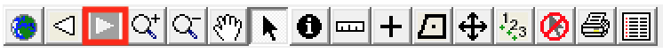

# Tools {#tools}

```{r, echo=FALSE}
knitr::include_graphics("images/toolbar.png")
```


We describe the tools ArborPro has to offer in this chapter. These tools can be broken down into two categories: editing tools and navigation tools. Editing tools allow users to modify the data and navigations tools allow users to navigate the map and locate specific trees. Below is a table that quickly summarises the tools:

```{r, echo=FALSE}
tools <- tibble::tribble(
  ~ Tool, ~ Description,
  "Full Extent", "Zoom to the full map extent as defined by user",
  "Zoom Previous", "Zoom to previous map extent",
  "Zoom Next", "Zoom to the next map extent (assuming you've rolled back to a previous map extent)",
  "Zoom In", "Zoom in closer to the map image",
  "Zoom Out", "Zoom out farther away from map image",
  "Pan", "'Pan and scan' the map by clicking and dragging the cursor",
  "Select", "Select trees by point and click, marquee selection, or polygon selection",
  "Identify", "Open the tree detail window of a tree",
  "Measure", "Measure distances",
  "Add Tree", "Add trees (points) to the map",
  "Add Polygon", "Draw polygons on the map",
  "Move Point", "Move trees (points) from one location to another",
  "Site Numbering", "Manually renumber tree sites",
  "Clear Selection", "Clear the current selected trees",
  "Print Map", "Print a map",
  "List", "Create a list"
)

# knitr::kable(tools)
gt::gt(tools)
```

## Tool Details

We've dedicated a section for each tool to go over in more detail.

### Full Extent

```{r, echo=FALSE}
knitr::include_graphics("images/toolbar-full-view.png")
```


When you open ArborPro it displays the _default map extent_. Users can modify that extent by going to _Tools_ then selecting _Set Default Map Extent_. The current map displayed will now be the default map view everytime ArborPro is opened. 

Often times, a tree inventory spans many miles and users will spend the day working on multiple areas in the map. As a result, zooming out can become time consuming. This is where the Full Extent tool becomes useful, when users need to quickly zoom into an area, do some work and then zoom back out to the full extent so that they can zoom into a different area on the map. To zoom back to the full map view, simply click the Full Extent tool.

### Zoom Previous

```{r, echo=FALSE}
knitr::include_graphics("images/toolbar-back-view.png")
```

This is another navigation tool that takes users to the previous map extent. Occasionally, users might zoom into an area on accident in which case, they want to go back to the previous map view. This is why the Zoom Previous tool exists.

### Zoom Next

```{r, echo=FALSE}

```

The Zoom Next tool is nearly identical to the Zoom Previous tool except it sends the user to the next map extent.

### Zoom In

```{r, echo=FALSE}
knitr::include_graphics("images/toolbar-zoom-in.png")
```

One of the most important navigation tools, this allows users to zoom into specific areas on the map. This can be done in two ways: point and click or drawing a box to zoom into the area inside that box^[The drawing a box method is often called _Marquee Zoom_.].

### Zoom Out

```{r, echo=FALSE}
knitr::include_graphics("images/toolbar-zoom-out.png")
```

Similar to the Zoom In tool with two exceptions: this zooms the user out and you may only point and click to zoom out.

### Pan

```{r, echo=FALSE}
knitr::include_graphics("images/toolbar-pan.png")
```

The pan tool lets users "pan and scan", i.e. it lets users point, click, and drag the map in a specific direction. Click on this tool to recenter the map. The mouse pointer will become a hand - click the map and move it in any direction.

### Select

```{r, echo=FALSE}
knitr::include_graphics("images/toolbar-select.png")
```

The select tool allows users to select trees in three ways: point and click, polygon select, box select. 

### Identify

```{r, echo=FALSE}
knitr::include_graphics("images/toolbar-identify.png")
```

The Identify tool allows users to inspect the details of a tree. One the tool is selected, clicking a tree will open the _Tree Detail_ window which displays tree characterists and work history.

### Measure

```{r, echo=FALSE}
knitr::include_graphics("images/toolbar-measure.png")
```

The measure tool allows users to measure distances.

### Add Tree

```{r, echo=FALSE}

```

Click this tool then click on the map to add a new tree. By default, the characteristics in the Detail form are taken from the nearest tree. This simplifies the data input as typically just a few things need to be changed. Remember to click on the Save button to save these characteristics.

### Add Polygon

```{r, echo=FALSE}

```

Click this tool then click on the map to add a new polygon. If trees are the currently selected group to the left of the map or if trees are the only option, this polygon becomes a Tree Stand.

### Move Point

```{r, echo=FALSE}
knitr::include_graphics("images/toolbar-move-point.png")
```

Click this tool when there are one or more trees selected to move the selected trees. Click on the map, hold the mouse button down, then move the mouse and release the mouse button. All selected trees are moved that distance. If there are selected trees outside the map view, ArborPro asks whether you wish to move them too.

### Site Numbering

```{r, echo=FALSE}

```

Click this tool to manually assign site numbers to trees. One the tool is selected the cursor will turn into a pencil - begin clicking points to renumber the sites.

### Clear Selection

```{r, echo=FALSE}
knitr::include_graphics("images/toolbar-clear-selection.png")
```

Clear the selected (in red) and highlighted (in yellow) trees. This also removes the numbered dots on tree lists.

### Print Map

```{r, echo=FALSE}
knitr::include_graphics("images/toolbar-print-map.png")
```

Click on this tool to print the map the way it currently looks in ArborPro. A neat line, logo, and text are included. Text on the bottom of the print page is specified beforehand using the File > Page Setup menu.

### List Editor

```{r, echo=FALSE}
knitr::include_graphics("images/toolbar-list-editor.png")
```

Opens the List Edtitor to create a new list, delete the selected trees from a list, or add the selected trees to an existing list.

