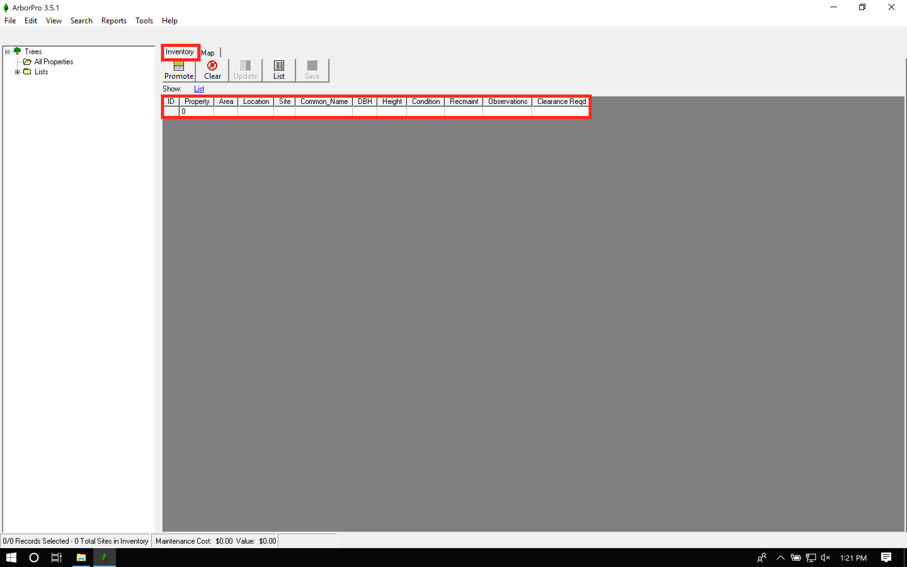

# Interface {#interface}

This chapter discusses the softwares interface and is organized into two main parts: the broader _main_ components of the interface and the smaller _specialized_ components of the interface. We split this chapter into these two sections.

## Main Components

The main components of ArborPro can further be broken down into four sections:

1. Map
2. Inventory Tab
3. Left Panel
4. Tool Bar
5. Menu Bar
6. Status Bar

```{r, echo=FALSE}
knitr::include_graphics("images/ui/ui-main.png")
```

In short, the map tab displays the map, the inventory tab displays the data as a spreadsheet, the left panel organizes properties and lists, and the tool bar organizes all available tools. We will go over all four components in more detail below.

### Map

### Inventory Tab

Selecting the inventory tab will display the data as a spreadsheet with columns and rows. For users comfortable with excel, the inventory tab should look pretty familiar^[Note that no data is displayed in the inventory view because the screenshot was taken from a fresh ArborPro install with an empty database.].

```{r, echo=FALSE}

```

### Left Panel

### Tool Bar

### Menu Bar

### Status Bar

## Specialized Components

Discuss things like the tree detail, map preferences, preferences, maintenance options, etc.
