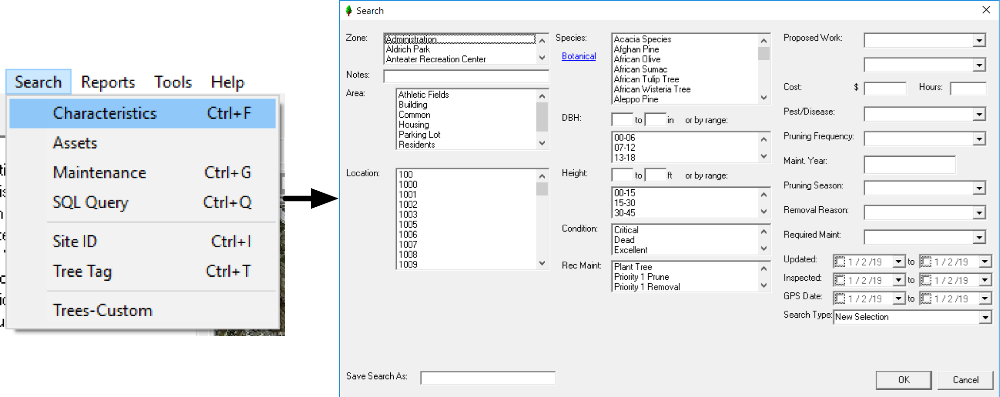
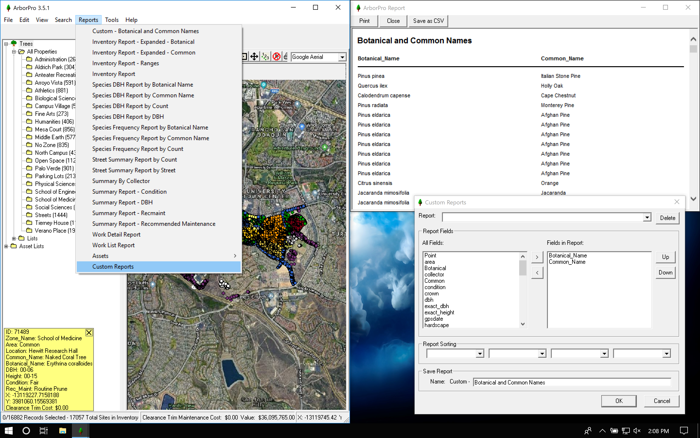
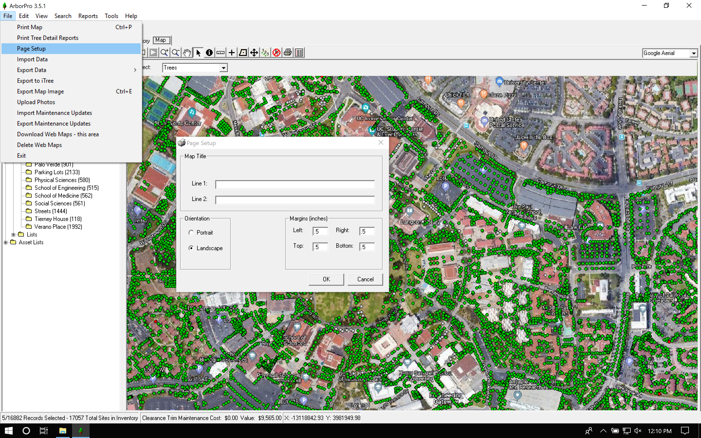
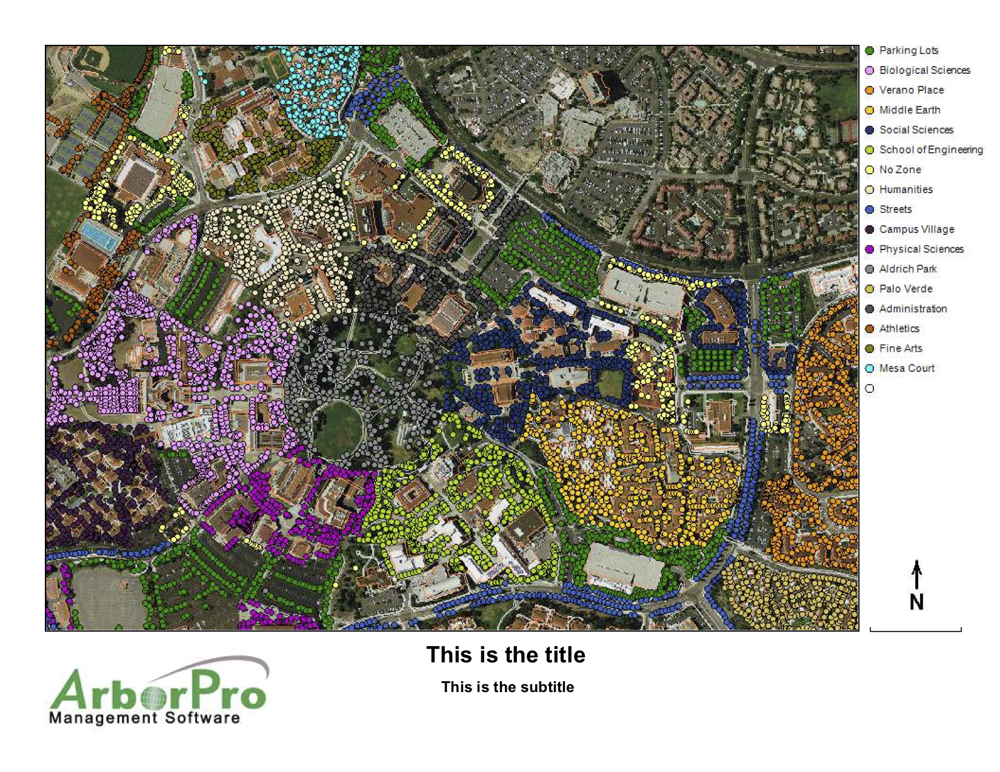
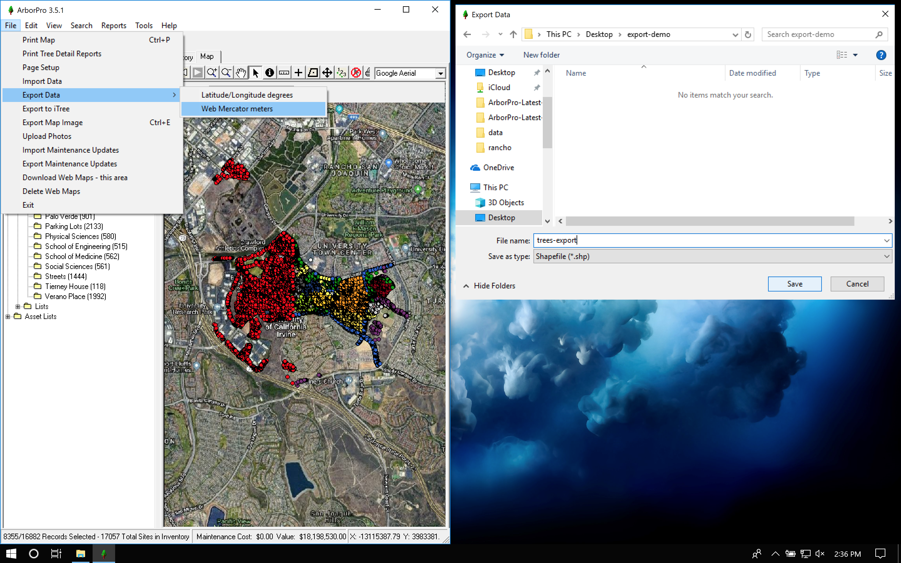
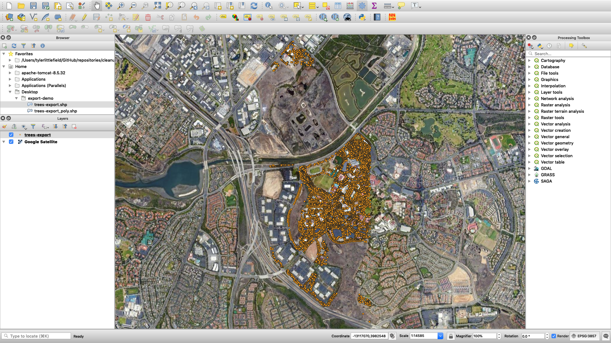

# Applications {#applications}

Some significant applications are demonstrated in this chapter. Think of it as an ArborPro cookbook with recipes for completing tasks. If you have a recipe in mind that you would like added to this list, please send our team an email [here](mailto:tyler@arborprousa.com) and we will add it.

## Identify Hazardous Trees

Locating hazardous trees is a common use case for many ArborPro users. Identifying trees of any criteria (hazard or not) is itself and important and powerful tool. Querying your inventory requires the search tool and a solid understanding of the search tool is necessary to prioritize your work efficiently. To begin searching either use the hotkey `Ctrl + F` or follow these steps:

1. Select **Search** in the top left-ish menu bar.
2. From the **Search** drop down menu, select **Characteristics**.

Having followed those steps, you should see a search window:

```{r, echo=FALSE}

```

From this point, you can find all hazardous trees selecting all trees with a **Target Rating** of **Hazard**:

```{r, echo=FALSE}
knitr::include_graphics("images/applications/search/search-hazard.png")
```

And that's pretty much it. The search tool is very intuitive and more complex searches can be made with ease. You can get creative with your searches and add multiple characteristics to a single search. Some other common searches are:

1. Search for a specific species
2. Search for all trees within a DBH range
3. Search by condition
4. Search by update/inspected/gps date
5. Search by recommended maintenance
6. Search by condition in a specific zone

Finally, it's important to understand that the search tool is only as good as the data collected. This is similar to the [**Garbage In, Garbage Out**](https://en.wikipedia.org/wiki/Garbage_in,_garbage_out) concept where poorly collected data will produce poor search results. Conversely, properly collected data will provide better search results. For more on the importance of data collection, see chapter \@ref(data-collection).

## Build a Custom Report

Out of the box, ArborPro provides numerous reports that are ready to be used. However, there may be times were you need a custom report with a specific set of fields. You may even need the sorting of those fields to behave in a specific way. To begin building a custom report follow these steps:

1. Select **Reports** from the menu bar
2. Select **Custom Reports**
3. Select a field from the **All Fields** menu
4. Select the **>** button to send the field to the **Fields in Report** menu
5. Repeat the steps until all desired fields are in the **Fields in Report** menu
6. (Optional) rearrange the fields as necessary with the **Up** and **Down** buttons, the higher up, the farther left in the report
7. Give the report a name
8. Select **OK**

After, the custom report will be saved and can be reused for future use. For example, here's a simple custom report that shows the botanical and common names:

```{r, echo=FALSE}

```

## Personalize Your Map

Users may personalize their map with things like titles, subtitles, logos, etc. Below is a list of all available options:

1. Title
2. Subtitle
3. Logo
4. Orientation, portrait/landscape/margins
5. Map Labels
6. Color coding
7. Basemap

The title, subtitle, and orientation are all configured in **Page Setup**:

```{r, echo=FALSE}

```

The logo is added by storing an image titled "logo.bmp" in the ArborPro install directory, typically `C:\Program Files\ArborPro`. Consider adjusting the size of the photo to 100x100px. By default, the ArborPro logo is typically stored there however, it can be overwritten by replacing the photo. An example map might look like:

```{r, echo=FALSE}

```

## Export Data

A major selling point with ArborPro is that users control and own their data. ArborPro doesn't "lock" you into the system, we make it easy for users to export their data. To export your data you have two options:

1. Export all the data
2. Export the selected data

In order to export a selection, follow these steps:

1. Select **File** from the menu bar
2. Select **Export Data**
3. Choose a coordinate reference system, either Lat/Lon or Web Mercator, ArborPro uses Web Mercator since this is what Google Maps uses
4. The export data window will open, choose a location to save the data

```{r, echo=FALSE}

```

From this point, you can open the data in any other geographic information system (GIS). For example, here's a screenshot of the exported data running in QGIS:

```{r, echo=FALSE}

```

## Configure Maintenance Settings

## Export/Import Maintenace Data

## Mass Update